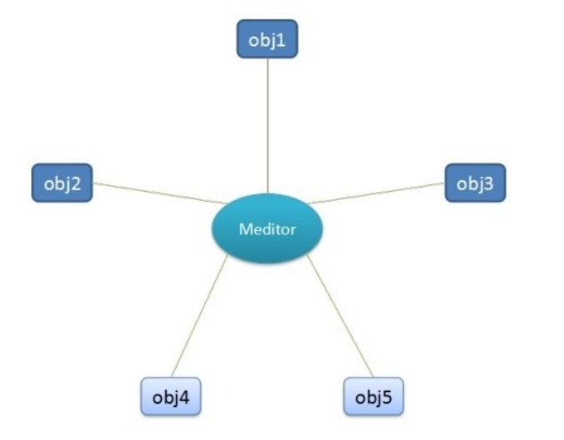
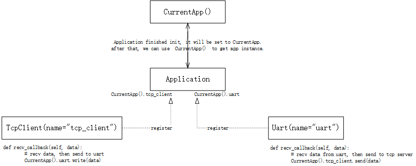
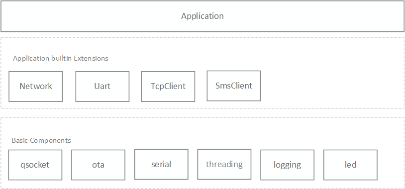
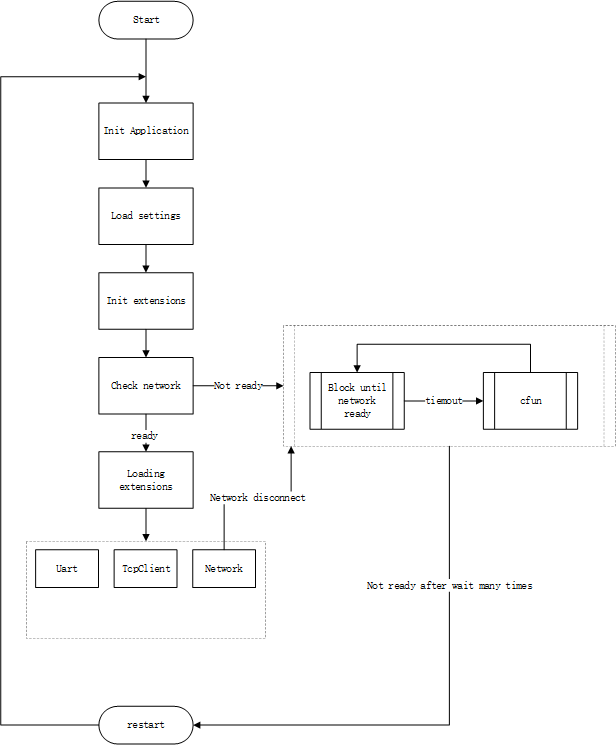

# QuecPython Application Framework - QFrame

[中文](README.zh.md) | English

## Overview

The `QFrame` application framework is a basic application framework developed by QuecPython. 

An application often relies on multiple business modules, and there may be coupling between the business modules. 
In the framework design, communication between business modules adopts a **star structure design**, as shown below:



The Meditor in the diagram is a mediator object (usually named `Application`). The business modules communicate through the `Application` object. This design is called the **mediator pattern**.

The business modules are plugged into the application program in the form of application extensions. The interaction between the application extensions is unifiedly dispatched through the `Application` object.

## Application Object

Applications based on the `QFrame` framework must have a central object to dispatch various business modules, namely the `Application` object mentioned above. Application parameters are also configured through this object.

Sample code:

```python
from usr.qframe import Application

# init application instance 
app = Application(__name__)  

# read settings from json file
app.config.from_json('/usr/dev.json')

# app.config is a python dict, you can use to update settings as below:  
app.config.update(
    {
        "UART": {
            "port":2,  
            "baudrate":115200,
            "bytesize":8,
            "parity":0, 
            "stopbits":1,
            "flowctl":0 
        }
    }
)
```

## Application Extensions

Application extensions refer to the plugged-in business modules that are loaded by the `Application` object.

In general, the application extension gets its own configuration from `app.config` and passes it to the application instance during initialization.  

The use of application extensions contains two parts: definition and initialization.

### Definition and Initialization of Application Extensions

The application extension provides a base class called `AppExtensionABC`, defined as follows:

```python
class AppExtensionABC(object):
    """Abstract Application Extension Class"""

    def __init__(self, name, app=None): 
        self.name = name  # extension name
        if app:
            self.init_app(app)

    def init_app(self, app):
        # register into app, then, you can use `app.{extesion.name}` to get current extension instance  

    def load(self):
        # loading extension functions, this method will be called in `app.mainloop` 
        raise NotImplementedError
```

This base class is inherited by the specific application extension class to constrain the interface definition of the application extension class. 

- We need to pass the `Application` application object to the initialization method `__init__`. When creating the application extension object, call `init_app` to complete the initialization of the extension; you can also directly create the application extension object without passing in the application object, and then explicitly call `init_app` later to complete the initialization.

- The `load` method is called by the `Application` object and is used to load the respective application extensions.

> The `name` attribute in the application extension definition is very critical because this attribute serves as the identity of the current application extension in app. Assuming the `name` attribute of the application extension is `name="serial"`, after registering the application extension into app, we can access the application extension object through `app.serial`.

### Interaction between Application Extensions 

As mentioned earlier, business modules are plugged into the application program in the form of application extensions. There must be interactions between businesses, and in the QFrame framework, after registering each application extension into `Application`, each application extension can call the interfaces of other application extensions through the application object.

In each business implementation, we can import the global `CurrentApp` to get the current application object instead of importing from the module that instantiates the application. As follows:  

```python
# import CurrentApp  
from usr.qframe import CurrentApp   

# get global current application
app = CurrentApp()
```

Use `CurrentApp` in multiple application extensions to implement interface calls between various application extensions.  

Now assume we have 2 application extensions:  

(1) TCP client: receive and send TCP server data  

```python 
# client.py
from usr.qframe import CurrentApp


class TcpClient(AppExtensionABC):
    
    def __init__(self, name, app=None):
        self.name = name
        if app is not None:
            self.init_app(app)
            
   	def init_app(self, app):
        # register TcpClient instance into app  
        app.append_extension(self)
   	
    def load(self): 
        # start tcp business, like connecting server
        pass
    
    def send(self, data):
        # send data to tcp server 
        pass
        
    def recv_callback(self, data):
        # recv data, then send to uart 
        CurrentApp().uart.write(data)
        
        
tcp_client = TcpClient('tcp_client')
```

(2) Serial port: receive and transmit serial port data  

```python
# uart.py
from usr.qframe import CurrentApp 


class Uart(AppExtensionABC):
    def __init__(self, name, app=None)
    	self.name = name
        if app is not None:
            self.init_app(app)
            
    def init_app(self, app):
        # register Uart object instance into app
        app.append_extension(self)
    
    def load(self): 
        # start uart business 
        pass
    
    def write(self, data):
        # write data to uart 
        pass
   	
    def recv_callback(self, data):
        # recv data from uart, then send to tcp server 
        CurrentApp().tcp_client.send(data)
        

uart = Uart('uart')
```

The application script is written as follows:  

```python
# main.py

from usr.uart import uart 
from usr.client import tcp_client  


app = Application()  

uart.init_app(app)  
tcp_client.init_app(app)   

app.mainloop() 
```

In the `main.py` script, the `app.mainloop()` function will call the `load` method of each application extension one by one to start the business functions of the application extension. For example, in `TcpClient.load`, the user should implement functions such as connecting to the server and listening to downstream data from the server; functions such as listening to serial port data should be implemented in `Uart.load`.  

Use `CurrentApp` to access the current global application object to call the interfaces of each application extension:  



Each application extension can use `CurrentApp()` to obtain the current globally unique application object, and then obtain the objects of each application extension through the application object, and then call the business interfaces of each application extension.  

As shown in the above code, after receiving data from the serial port, get the TCP client object via `CurrentApp().tcp_client` and then use its `send` method to relay the serial port data to the TCP server; after the TCP client receives data, get the serial port object via `CurrentApp().uart`  and then use its `write` method to relay the server data to the serial port.  

## Component Diagram

  

`Application`: Main application object  

- Built-in application extension components
  - `Network`: Network detection component. Provides abnormal network recovery.  
  - `Uart`: Serial port component, provides serial read and write functionality.
  - `TcpClient`: TCP client component, provides TCP read/write and client reconnection capabilities.  
  - `SmsClient`: SMS client component, provides SMS read/write capabilities.
- Basic components  
  - `qsocket`: Provides socket creation interface.  
  - `ota`: Provides ota upgrade interface.
  - `serial`: Provides basic serial read/write interfaces.
  - `threading`: Provides thread creation interface, mutex locks, condition variables, thread-safe queues, thread pools, etc.  
  - `logging`: Provides log interface.
  - `led`: Provides LED control interface.  

## Initialization Process 

  

System initialization process:  

1. Instantiate application object  
2. Import configuration json file  
3. Initialize each application extension component (this step will register each application extension into the main application object to facilitate communication between extensions)  
4. Detect network (this step will block waiting for network readiness, if the timeout expires, try cfun switching to recover the network)  
5. Load application extensions and start related services (custom implementation by user)
6. The system enters normal running state (network detection is enabled by default. In case of network disconnection, it will try cfun switching automatically to restore network)  

## Built-in Components  

### TCP Client Component `TcpClient`  

This class exposes two interfaces to the user:  

- The `recv_callback` method. The user overrides this method to handle downstream data from the TCP server. 
- The `send` method. The user can call this method to send data to the server.  

At the same time, this class provides server auto-reconnection capability.  

Code:

```python  
class TcpClient(AppExtensionABC):
   	# ...
    def recv_callback(self, data):
        raise NotImplementedError('you must implement this method to handle data received by tcp.')
    
    def send(self, data): 
        # TODO: uplink data method
        pass
```

### Serial Communication Component `Uart`  

This class exposes two interfaces to the user:

- The `recv_callback` method. The user overrides this method to handle the received serial port data.  
- The `send` method. The user can call this method to send data to the serial port.   

Code:  

```python
class Uart(AppExtensionABC):
    # ...
    def recv_callback(self, data): 
        raise NotImplementedError('you must implement this method to handle data received from device.')
    
    def write(self, data):
        # TODO: write data to uart 
        pass
```

### Network Component `NetWork`  

This class exposes three interfaces to the user:  

- The `wait_network_ready` method. This interface will block and wait for the network to reconnect, automatically perform CFun switching in an attempt to restore the network.
- The `register_net_callback` method. This interface registers a network exception callback which will be invoked when the network connects or disconnects.  
- The `register_sim_callback` method. This interface registers a SIM hot swap callback which will be invoked when the SIM card is inserted or removed.  

Code:  

```python
class NetWorker(AppExtensionABC):
    
    def wait_network_ready(self):
        # blocking until network ready 
        pass
    
    def register_net_callback(self, cb):
        # register a net change callback
        pass
    
    def register_sim_callback(self, cb): 
        # register a sim change callback
        pass
```

### SMS Client Component `SmsClient`  

This class exposes the `recv_callback` method. The user overrides this interface to process received SMS messages.  

Code:  

```python 
class SmsClient(AppExtensionABC):
    # ...
    def recv_callback(self, phone, msg, length):
        # recv a sms message  
        pass
    
    def start(self):
        # start a thread, listen new sms message coming
        pass
```

## Serial Port and TCP Server Relay Demo  

```python
# demo.py

import checkNet  
from usr.qframe import Application, CurrentApp
from usr.qframe import TcpClient, Uart
from usr.qframe.logging import getLogger

logger = getLogger(__name__)


PROJECT_NAME = 'Sample DTU'
PROJECT_VERSION = '1.0.0'  

def poweron_print_once():
    checknet = checkNet.CheckNetwork(
        PROJECT_NAME,  
        PROJECT_VERSION,
    )
    checknet.poweron_print_once()
    
    
class BusinessClient(TcpClient):

    def recv_callback(self, data):
        """implement this method to handle data received from tcp server

        :param data: data bytes received from tcp server
        :return:
        """
        logger.info('recv data from tcp server, then post to uart') 
        CurrentApp().uart.write(data)
        
        
class UartService(Uart):

    def recv_callback(self, data):
        """implement this method to handle data received from UART

        :param data: data bytes received from UART
        :return:
        """
        logger.info('read data from uart, then post to tcp server')
        CurrentApp().client.send(data)
        
        
def create_app(name='DTU', config_path='/usr/dev.json'):
    # init application
    _app = Application(name)
    # read settings from json file  
    _app.config.from_json(config_path)

    # init business tcp client
    client = BusinessClient('client') 
    client.init_app(_app)

    # init business uart  
    uart = UartService('uart')
    uart.init_app(_app)

    return _app


app = create_app()  


if __name__ == '__main__':
    poweron_print_once()
    app.mainloop()
```
