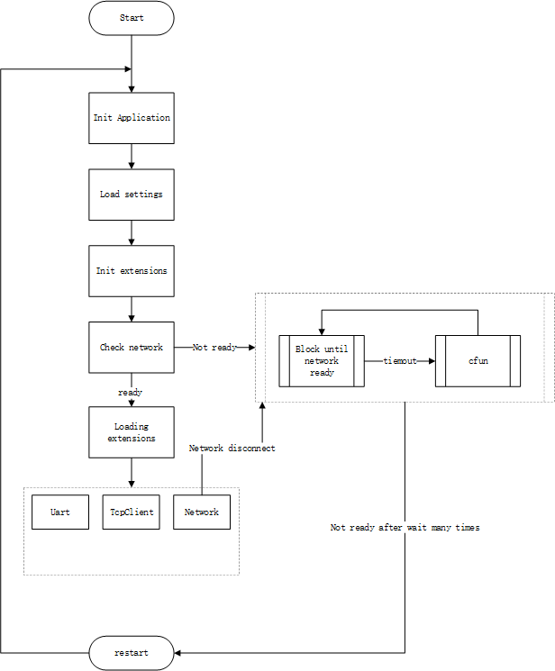

# QuecPython 应用框架——QFrame

中文 | [English](README.md)

## 概述

`QFrame` 应用框架是 QuecPython 开发的一个基础应用框架。

一个应用程序往往会依赖多个业务模块，各业务模块之间可能存在耦合现象。
在框架设计中，业务模块之间通信是采用**星型结构设计**，如下图所示：


图中的 Meditor是一个中介对象（通常命名为 `Application`），各个业务模块之间通过 `Application` 对象通信，这种设计被称之为**中介模式**。

业务模块以应用拓展的形式安插在应用程序中，而各应用拓展之间的交互通过 `Application` 对象进行统一调度。

## 应用对象

基于 `QFrame` 框架的应用程序必须有一个调度各业务模块的的中心对象，即上文提到的 `Application` 对象；应用参数也是通过该对象配置。

示例代码如下：

```python
from usr.qframe import Application

# init application instance
app = Application(__name__)

# read settings from json file
app.config.from_json('/usr/dev.json')

# app.config is a python dict, you can use to update settings as below:
app.config.update(
    {
        "UART": {
            "port":2,
            "baudrate":115200,
            "bytesize":8,
            "parity":0,
            "stopbits":1,
            "flowctl":0
        }
    }
)
```

## 应用拓展

应用拓展指的是被 `Application` 对象加载的业务模块。

一般来说，应用拓展从 `app.config` 获取其自身的配置并在初始化时传递给应用实例。

应用拓展的使用包含定义和初始化两部分。

### 应用拓展的定义与初始化

应用拓展提供一个名为 `AppExtensionABC` 的基类，定义如下：

```python
class AppExtensionABC(object):
    """Abstract Application Extension Class"""

    def __init__(self, name, app=None):
        self.name = name  # extension name
        if app:
            self.init_app(app)

    def init_app(self, app):
        # register into app, then, you can use `app.{extesion.name}` to get current extension instance
        app.append_extesion(self)

    def load(self):
        # loading extension functions, this method will be called in `app.mainloop`
        raise NotImplementedError
```

该基类被具体的应用拓展类继承，用来约束应用拓展类的接口定义。

- 我们需要向初始化方法 `__init__` 传入 `Application` 应用程序对象。在创建应用拓展对象时调用 `init_app` 来完成拓展的初始化动作；亦可不传入应用对象，而直接创建应用拓展对象，后面再显性调用 `init_app` 来完成初始化。
- `load` 方法用来被 `Application` 对象调用，用于加载各应用拓展。

> 应用拓展定义中的 `name` 属性非常关键，因为该属性作为当前应用拓展在app中的标识。假设应用拓展的 `name` 属性为 `name="serial"`，那么在注册应用拓展到 app 后，我们可以通过 `app.serial` 来访问该应用拓展对象。

### 应用拓展交互

上文提到，业务模块以应用拓展的形式安插在应用程序中。业务之间必然存在交互，在 QFrame 框架中，我们将每个应用拓展注册进 `Application` 后，每个应用拓展就可以通过应用程序对象来调用其他应用拓展的接口了。

在每个业务实现中，我们可以通过导入全局 `CurrentApp`，来获取当前应用程序对象，而不需要从实例化应用程序的模块中导入。如下：

```python
# import CurrentApp
from usr.qframe import CurrentApp

# get global current application
app = CurrentApp()
```

在多个应用拓展中使用 `CurrentApp` 来实现各应用拓展之间的接口调用。

现假设我们有 2 个应用拓展：

（1）TCP 客户端：收发 tcp 服务器数据

```python
# client.py
from usr.qframe import CurrentApp


class TcpClient(AppExtensionABC):
    
    def __init__(self, name, app=None):
        self.name = name
        if app is not None:
            self.init_app(app)
            
   	def init_app(self, app):
        # register TcpClient instance into app
        app.append_extension(self)
   	
    def load(self):
        # start tcp business, like connecting server
        pass
    
    def send(self, data):
        # send data to tcp server
        pass
        
    def recv_callback(self, data):
        # recv data, then send to uart
        CurrentApp().uart.write(data)
        
        
tcp_client = TcpClient('tcp_client')
```

（2）串口：收发串口数据

```python
# uart.py
from usr.qframe import CurrentApp


class Uart(AppExtensionABC):
    def __init__(self, name, app=None)
    	self.name = name
        if app is not None:
            self.init_app(app)
            
    def init_app(self, app):
        # register Uart object instance into app
        app.append_extension(self)
    
    def load(self):
        # start uart business
        pass
    
    def write(self, data):
        # write data to uart
        pass
   	
    def recv_callback(self, data):
        # recv data from uart, then send to tcp server
        CurrentApp().tcp_client.send(data)
        

uart = Uart('uart')
```

应用脚本编写如下：

```python
# main.py

from usr.uart import uart
from usr.client import tcp_client


app = Application()

uart.init_app(app)
tcp_client.init_app(app)

app.mainloop()
```

在 `main.py` 脚本中，`app.mainloop()` 函数会逐个调用应用拓展的 `load` 方法来启动应用拓展的各项业务功能。比如，在 `TcpClient.load` 中用户应该实现如连接服务器、监听服务器下行数据等功能；应该在 `Uart.load` 中实现监听串口数据等功能。

使用 `CurrentApp` 来访问当前应用程序对象，以便调用各应用拓展接口：


各个应用拓展中可以使用 `CurrentApp()` 来获取当前全局唯一应用程序对象，并通过应用程序对象来获取各个应用拓展对象，继而调用各应用拓展的业务接口。

如上述代码所示，串口收到数据后，通过 `CurrentApp().tcp_client` 来获取 tcp 客户端对象，继而使用该对象 `send` 方法将串口数据透传至 tcp 服务器；tcp 客户端收到数据后，通过 `CurrentApp().uart` 来获取串口对象，接入使用该对象 `write` 方法将服务器数据透传给串口。

## 组件框图


`Application`：主应用对象

- 内建应用拓展组件
  - `Network`：网络检测组件。提供异常断网恢复。
  - `Uart`：串口组件，提供串口读写功能。
  - `TcpClient`：TCP 客户端组件， 提供 tcp 读写和客户端重连功能。
  - `SmsClient`：短信客户端组件，提供短信读写功能。
- 基础组件
  - `qsocket`：提供创建 socket 接口。
  - `ota`：提供 ota 升级接口。
  - `serial`：提供串口读写基本接口。
  - `threading`：提供创建线程接口、互斥锁、条件变量、线程安全队列、线程池等接口。
  - `logging`：提供日志接口。
  - `led`：提供 led 灯控制接口。

## 初始化流程图



系统流程初始化步骤：

1. 实例化应用对象
2. 导入配置 json 文件
3. 初始化各应用拓展组件（此步骤会将各个应用拓展注册进主应用对象中，方便各拓展之间通信）
4. 检测网路（此步骤会阻塞等待网络就绪，若等待超时则尝试 cfun 切换以恢复网络）
5. 加载应用拓展，并启动相关服务（用户可自定义实现）
6. 系统进入正常运行状态（默认开启sim卡和网络检测，若出现掉网情况，会自行尝试cfun切换以恢复网络）

## 内置组件

### TCP 客户端组件 `TcpClient`

该类向用户开放了两个接口：

- `recv_callback` 方法，用户通过重写该方法，实现对 tcp 服务器下行数据的业务处理。
- `send` 方法，用户可调用该方法发送数据至服务器。

同时，该类提供了服务器自动重连的功能。

代码如下：

```python
class TcpClient(AppExtensionABC):
   	# ...
    def recv_callback(self, data):
        raise NotImplementedError('you must implement this method to handle data received by tcp.')
    
    def send(self, data):
        # TODO: uplink data method
        pass
```

### 串口通信组件 `Uart`

该类向用户开放了两个接口：

- `recv_callback` 方法，用户通过重写该方法，实现对接收到的串口数据的业务处理。
- `send` 方法，用户可调用该方法向串口发送数据。

代码如下：

```python
class Uart(AppExtensionABC):
    # ...
    def recv_callback(self, data):
        raise NotImplementedError('you must implement this method to handle data received from device.')
    
    def write(self, data):
        # TODO: write data to uart
        pass
```

### 网络组件 `NetWork`

该类向用户开放了三个接口：

- `wait_network_ready` 方法，此接口将以阻塞方式等待网络重连，自动CFun切换以期恢复网络。
- `register_net_callback` 方法，此接口注册一个网络异常回调，当网络连接或断开时候会被调用。
- `register_sim_callback` 方法，此接口注册一个sim热插拔回调，当sim卡发生插拔动作时候会被调用。

代码如下：

```python
class NetWorker(AppExtensionABC):
    
    def wait_network_ready(self):
        # blocking until network ready
        pass
    
    def register_net_callback(self, cb):
        # register a net change callback
        pass
    
    def register_sim_callback(self, cb):
        # register a sim change callback
        pass
```

### 短信客户端组件 `SmsClient`

该类开放 `recv_callback` 方法，用户重写此接口来处理接收到的短信消息。

代码如下：

```python
class SmsClient(AppExtensionABC):
    # ...
    def recv_callback(self, phone, msg, length):
        # recv a sms message
        pass
    
    def start(self):
        # start a thread, listen new sms message coming
        pass
```

## 串口与TCP服务器透传demo

```python
# demo.py

import checkNet
from usr.qframe import Application, CurrentApp
from usr.qframe import TcpClient, Uart
from usr.qframe.logging import getLogger

logger = getLogger(__name__)


PROJECT_NAME = 'Sample DTU'
PROJECT_VERSION = '1.0.0'

def poweron_print_once():
    checknet = checkNet.CheckNetwork(
        PROJECT_NAME,
        PROJECT_VERSION,
    )
    checknet.poweron_print_once()
    
    
class BusinessClient(TcpClient):

    def recv_callback(self, data):
        """implement this method to handle data received from tcp server

        :param data: data bytes received from tcp server
        :return:
        """
        logger.info('recv data from tcp server, then post to uart')
        CurrentApp().uart.write(data)
        
        
class UartService(Uart):

    def recv_callback(self, data):
        """implement this method to handle data received from UART

        :param data: data bytes received from UART
        :return:
        """
        logger.info('read data from uart, then post to tcp server')
        CurrentApp().client.send(data)
        
        
def create_app(name='DTU', config_path='/usr/dev.json'):
    # init application
    _app = Application(name)
    # read settings from json file
    _app.config.from_json(config_path)

    # init business tcp client
    client = BusinessClient('client')
    client.init_app(_app)

    # init business uart
    uart = UartService('uart')
    uart.init_app(_app)

    return _app


app = create_app()


if __name__ == '__main__':
    poweron_print_once()
    app.mainloop()
```

